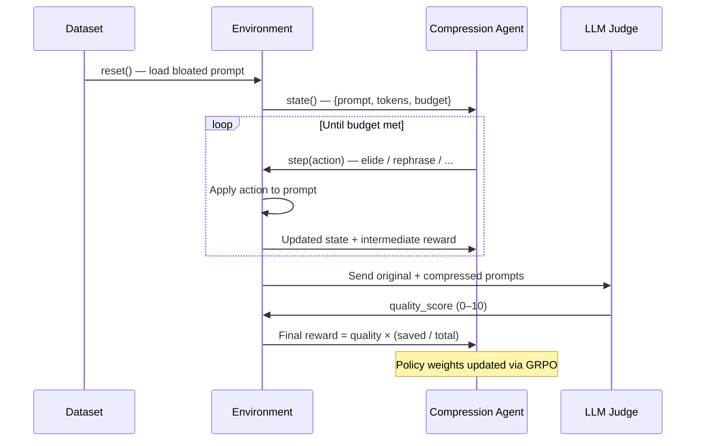

# PromptZip RL — Agents

## Overview

PromptZip RL has **two agents** that interact within the environment: the **Compression Agent** (the RL policy being trained) and the **LLM Judge** (the quality evaluator that produces the reward signal). They operate in a closed loop — one compresses, the other scores — and neither has access to external APIs at runtime.

---

## Agent 1: Compression Agent (RL Policy)

### Role
The primary agent being trained. It observes a bloated prompt and iteratively applies compression actions to reduce token count while preserving meaning.

### Observation Space
```
{
  prompt_text: str,        # Current prompt content
  token_count: int,        # Current token count
  task_type: str,          # "summarization" | "code_gen" | "reasoning" | ...
  token_budget: int,       # Target token count to stay under
  action_history: list     # Previous actions taken this episode
}
```

### Action Space
| Action | Description | When the agent learns to use it |
|--------|-------------|-------------------------------|
| `rephrase` | Rewrite a clause in fewer tokens | Verbose instructions, formal language |
| `elide` | Delete a filler phrase entirely | "Please be thorough", "I would like you to" |
| `chunk` | Split prompt into smaller batches | Large context with repetitive structure |
| `compress` | Replace wordy phrases with shorter equivalents | Corporate/academic boilerplate |

### Behavior
- Takes **multiple actions per episode** (one per `step()` call)
- Continues until token count ≤ budget or the environment terminates
- Policy is updated via **GRPO** (Group Relative Policy Optimization) through TRL/Torchforge

### Learned Strategies (Emergent)

Over training, the agent develops task-type-conditioned strategies:

| Task Type | Learned Priority |
|-----------|-----------------|
| Summarization | Elide the request framing, preserve source content |
| Code generation | Preserve system prompt, compress user instructions |
| Multi-step reasoning | Keep chain-of-thought structure, elide only padding |
| Q&A | Strip polite preamble, preserve the question core |

---

## Agent 2: LLM Judge (Quality Evaluator)

### Role
A frozen LLM that acts as the environment's **grader**. It compares the output produced by the compressed prompt against the output produced by the original (baseline) prompt, and returns a quality score.

### Input
```
{
  original_prompt: str,       # The uncompressed prompt
  compressed_prompt: str,     # The agent's compressed version
  original_output: str,       # LLM output from original prompt
  compressed_output: str,     # LLM output from compressed prompt
  task_type: str              # Context for evaluation rubric
}
```

### Output
```
quality_score: float  # 0.0 – 10.0
```

### Scoring Rubric
The judge evaluates along these dimensions:
- **Semantic preservation** — Does the compressed output cover the same key points?
- **Factual accuracy** — Are all facts from the baseline preserved?
- **Completeness** — Is anything meaningful missing?
- **Coherence** — Is the compressed output well-structured?

### Design Decisions
- The judge is **frozen** — it does not learn or update during training. This prevents reward hacking where the policy co-adapts with the judge.
- The judge runs **inside the environment**, not as an external API call. This makes the environment fully self-contained and deployable in a single Docker container.
- The judge hooks into OpenEnv's built-in **LLMJudge** rubric/evaluation support.

---

## Agent Interaction Loop



---

## Reward Signal Flow

```
                    Compression Agent
                          │
                    step(action) × N
                          │
                          ▼
              ┌─────────────────────┐
              │   Environment       │
              │   applies actions,  │
              │   tracks token Δ    │
              └────────┬────────────┘
                       │
            compressed prompt + original prompt
                       │
                       ▼
              ┌─────────────────────┐
              │   LLM Judge         │
              │   (frozen)          │
              │   quality_score     │
              └────────┬────────────┘
                       │
          reward = quality × (saved / total)
                       │
                       ▼
              ┌─────────────────────┐
              │   GRPO / TRL        │
              │   policy update     │
              └─────────────────────┘
```

---

## Key Constraints

| Property | Compression Agent | LLM Judge |
|----------|------------------|-----------|
| **Trainable** | ✅ Yes — weights updated each episode | ❌ No — frozen throughout |
| **Runs per episode** | Multiple `step()` calls | Once at episode end |
| **External deps** | None | None |
| **GPU required** | No | No |
| **Deployed as** | Part of Docker container | Part of Docker container |
