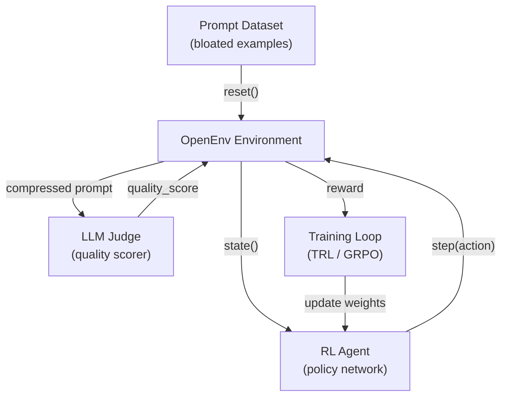

# PromptZip RL — Design Document

## What It Is

PromptZip RL is a reinforcement learning environment where an agent learns to compress LLM prompts — removing bloat, rephrasing verbose instructions, eliding filler — while preserving the quality of the model's output. It trains a "prompt editor" through trial and error, not hand-written rules.

The environment is built on [OpenEnv](https://github.com/meta-pytorch/OpenEnv), Meta's Gymnasium-style interface for RL post-training.

---

## The Problem

Every LLM call wastes 30–50% of tokens on boilerplate and filler. Output tokens are priced 4–5× higher than input. At enterprise scale, prompt bloat costs thousands per month — and usage is growing faster than prices are falling. No existing product solves this with RL.

---

## MDP Formulation

| Component | Definition |
|-----------|-----------|
| **State** | `{prompt_text, token_count, task_type, token_budget, action_history}` |
| **Actions** | `{rephrase, elide, chunk, compress}` — each is one `step()` call |
| **Reward** | `quality_score × (tokens_saved / tokens_original)` |
| **Termination** | Token count ≤ budget **or** quality drops below threshold |
| **Grader** | LLM-as-judge scoring compressed output vs. baseline |

### Action Space

| Action | What It Does | Best For |
|--------|-------------|----------|
| **Rephrase** | Rewrite a clause to convey the same meaning in fewer tokens | Verbose instructions |
| **Elide** | Delete redundant filler phrases entirely | Boilerplate like "please be thorough" |
| **Chunk** | Split a long prompt into smaller batches, process sequentially | Large context windows |
| **Compress** | Replace wordy phrases with shorter equivalents | Formal/corporate language |

The agent can take **multiple actions per episode**, one `step()` at a time, until the token budget is met.

---

## Reward Design

```
reward = quality_score × (tokens_saved / tokens_original)
```

The multiplicative structure creates a natural tension:

| Scenario | Quality | Savings | Reward | Signal |
|----------|---------|---------|--------|--------|
| Smart compression | 9.1/10 | 82% | **+7.46** | Strong positive |
| Aggressive but lossy | 4/10 | 82% | +3.3 | Weak — quality tanked |
| Nothing removed | 10/10 | 0% | 0.0 | No reward |
| Meaning destroyed | — | — | **−5.0** | Penalty |

The agent can't just delete everything. It must learn *what* is safe to remove — which turns out to be polite preambles, redundant instructions, and filler phrases.

---

## Why RL, Not Rules

A static regex compressor can't learn task-type-specific strategies:

- **Code generation tasks**: preserve the full system prompt, compress the user query heavily
- **Summarization tasks**: compress the request ("Summarize:"), preserve the source content
- **Multi-step reasoning**: preserve chain-of-thought structure, elide only padding

The RL agent learns these asymmetries across thousands of episodes, generalizing to prompts it has never seen before. The policy learns *which* action to apply first, and *to which* part of the prompt, conditioned on the task type.

---

## OpenEnv Integration

| API | Behavior |
|-----|----------|
| `reset()` | Loads the next bloated prompt from the dataset |
| `state()` | Returns current prompt text + token count |
| `step(action)` | Applies one compression action, returns new prompt + intermediate reward |

The LLM judge lives **inside** the environment, making it fully self-contained:
- Deployable to Hugging Face Spaces in a single Docker container
- Directly compatible with **TRL**, **Torchforge (GRPO)**, **SkyRL**, and **Unsloth**
- No GPU required — pure text I/O, `echo_env` scaffold

---

## Episode Walkthrough

```
1. reset() → Load: "I would like you to please provide me with a very
   detailed and comprehensive summary of the main points covered in the
   following text. Please make sure to be thorough..." (68 tokens)

2. Agent observes: {task_type: summarization, budget: 40 tokens}

3. step(elide) → Remove filler preamble → 32 tokens remaining

4. step(rephrase) → "Summarize:" + content → 12 tokens

5. Grader: LLM judge scores output quality → 9.1/10

6. Reward: 9.1 × (56/68) = +7.46 → Policy updated via GRPO
```

**What the agent learns over time:**

| Learns to do ✅ | Learns to avoid ❌ |
|-----------------|-------------------|
| Remove polite preambles first | Compressing factual content |
| Prefer "Summarize:" over long requests | Eliding task-critical instructions |
| Preserve all concrete data | Exceeding the token budget |

---

## Architecture



---

## Deployment

| Component | Implementation |
|-----------|---------------|
| **Container** | Single Docker image (FastAPI + Python) |
| **Platform** | Hugging Face Spaces |
| **Training** | TRL / Torchforge GRPO pipeline |
| **Dataset** | Curated bloated prompts across task types |
| **Dependencies** | No GPU, no external APIs, no simulation libraries |
