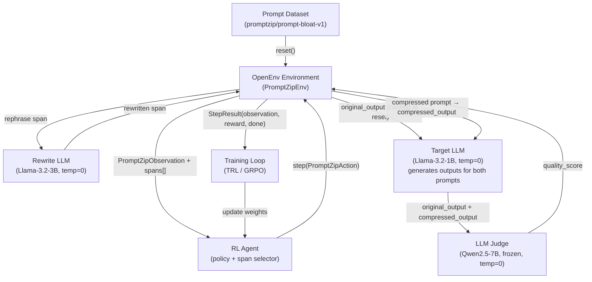

# PromptZip RL — Design Document

## What It Is

PromptZip RL is a reinforcement learning environment where an agent learns to compress LLM prompts — removing bloat, rephrasing verbose instructions, eliding filler — while preserving the quality of the model's output. It trains a "prompt editor" through trial and error, not hand-written rules.

The environment is built on [OpenEnv](https://github.com/meta-pytorch/OpenEnv), Meta's Gymnasium-style interface for RL post-training.

---

## The Problem

Every LLM call wastes 30–50% of tokens on boilerplate and filler. Output tokens are priced 4–5× higher than input. At enterprise scale, prompt bloat costs thousands per month — and usage is growing faster than prices are falling. No existing product solves this with RL.

---

## MDP Formulation

| Component | Definition |
| --- | --- |
| **State** | `PromptZipObservation` (see OpenEnv Models below) |
| **Actions** | `PromptZipAction(action_type, span_id)` — each is one `step()` call |
| **Reward** | Intermediate: token delta per step. Final: `quality_score × (tokens_saved / tokens_original)` |
| **Termination** | Token count ≤ budget, quality < threshold, max_steps reached, or short-circuit (all-locked/empty) |
| **max_steps** | `2 × len(spans)` — each span can be touched at most twice |
| **Grader** | LLM-as-judge (temperature=0, single call) scoring compressed output vs. baseline |

### Action Space

| Action | What It Does | Execution | Best For |
| --- | --- | --- | --- |
| **Rephrase** | Rewrite a clause to convey the same meaning in fewer tokens | Calls Rewrite LLM with `"Rewrite concisely, preserve meaning: {span}"` | Verbose instructions, formal/corporate language |
| **Elide** | Delete a selected span entirely | Removes the span; no LLM call needed | Boilerplate like "please be thorough", polite preambles |
| **Preserve** | Mark a span as off-limits for further compression | Tags span; skips it in future steps | Task-critical instructions, factual content |

The agent selects an action **and a target span** (sentence or clause UUID) per step via a single `PromptZipAction` model — see OpenEnv Models below.

---

## OpenEnv Models

These typed Pydantic models implement OpenEnv's base classes and are required for the environment to deploy correctly.

### Action

```python
```python
from openenv.core.models import Action

class PromptZipAction(Action):
    action_type: Literal["rephrase", "elide", "preserve"]
    span_id: str  # UUID key into spans dict
```

### Observation

```python
from openenv.core.models import Observation

class PromptZipObservation(Observation):
    done: bool = False
    reward: float | int | None = None
    metadata: dict = {}
    prompt_text: str           # Current full prompt text
    spans: dict[str, str]      # {uuid: span_text} — stable IDs
    token_count: int           # Current token count (approx len(words)*1.3)
    task_type: str             # "summarization" | "code_gen" | "reasoning" | "qa"
    token_budget: int          # Target token count to stay under
    action_history: list       # [(action_type, span_id), ...] — previous steps
    locked_spans: list[str]    # UUIDs of preserved spans
```

### Step Return

`step()` returns the updated `PromptZipObservation` (where `done` and `reward` are populated) — OpenEnv's standard contract. The `done` flag is `True` when any termination condition is met.

---

## How `step(action)` Works

This is the core execution mechanism. Each step:

1. **Agent outputs** a `PromptZipAction(action_type, span_id)`.
2. **Environment executes**:
   - `elide`: removes the span from `spans` dict and rebuilds `prompt_text`.
   - `rephrase`: sends the span to the Rewrite LLM (`"Rewrite concisely... {span}"`). Span is replaced with the response.
   - `preserve`: tags the span UUID in `locked_spans`; future steps skip it.
3. **Environment returns** updated `PromptZipObservation` containing intermediate reward.
4. Loop continues until termination condition is met.
5. At episode end (unless short-circuited), Target LLM generates outputs for both prompts; LLM Judge scores the comparison.

The Rewrite LLM runs at `temperature=0` for deterministic outputs. It is **not** the same model as the Judge.

---

## Reward Design

### Intermediate Reward (per step)

```
step_reward = (prev_token_count - new_token_count) / original_token_count × 0.5
```

Positive when the step reduces tokens. Negative when a bad rephrase increases tokens.

### Final Reward (episode end)

```
final_reward = quality_score × (tokens_saved / tokens_original)
```

| Scenario | Quality | Savings | Final Reward | Signal |
| --- | --- | --- | --- | --- |
| Smart compression | 9.1/10 | 82% | **+7.46** | Strong positive |
| Aggressive but lossy | 4/10 | 82% | +3.3 | Weak — quality tanked |
| Nothing removed | 10/10 | 0% | 0.0 | No reward |
| Meaning destroyed | — | — | **−5.0** | Penalty |

### Quality Drop Penalty

If `quality_score` drops below 6.0 at episode end, an additional penalty of `−5.0` is applied.

---

## Why RL, Not Rules

A static regex compressor can't learn task-type-specific strategies:

* **Code generation tasks**: preserve the full system prompt, compress the user query heavily
* **Summarization tasks**: compress the request ("Summarize:"), preserve the source content
* **Multi-step reasoning**: preserve chain-of-thought structure, elide only padding

The RL agent learns these asymmetries across thousands of episodes, generalizing to prompts it has never seen before.

---

## OpenEnv Integration

| API | Behavior |
| --- | --- |
| `reset()` | Loads the next bloated prompt; segments into UUID-keyed spans; pre-generates `original_output` via Target LLM; returns initial `PromptZipObservation` |
| `state` | Returns current `State(episode_id, step_count)` |
| `step(PromptZipAction)` | Applies one compression action to the selected span; returns updated `PromptZipObservation` (with reward, done) |

---

## Dataset

The training dataset consists of **500 bloated prompts** across 4 task types (125 each):

| Task Type | Generation Method | Bloat Type |
| --- | --- | --- |
| Summarization | Clean prompt → GPT-4 expands with filler | Polite preambles, redundant instructions |
| Code generation | Stack Overflow questions → manually padded | Hedging language, over-specified formatting requests |
| Multi-step reasoning | BIG-Bench tasks → wrapped in boilerplate | Meta-instructions, verbose role-play framing |
| Q&A | TriviaQA → padded with academic register | Formal preambles, restated context |

Each example includes: `{bloated_prompt, clean_prompt, task_type, token_budget}`. The `clean_prompt` serves as a reference for judge calibration but is **not** given to the agent.

Dataset is versioned and published to Hugging Face Hub at `promptzip/prompt-bloat-v1`.

---

## Episode Walkthrough

```
1. reset() → Load: "I would like you to please provide me with a very
   detailed and comprehensive summary of the main points covered in the
   following text. Please make sure to be thorough..." (68 tokens)
   spans = ["I would like you to please provide me with a very detailed
             and comprehensive summary of", "the main points covered in
             the following text.", "Please make sure to be thorough..."]
   original_output = Target LLM("I would like you to...") → cached

2. Agent observes: PromptZipObservation {task_type: "summarization", budget: 20 tokens}

3. step(PromptZipAction(action_type="elide", span_index=0))
   → "the main points covered in the following text. Please make sure to be thorough..."
   → step_reward = (68 - 42) / 68 × 0.5 = +0.19

4. step(PromptZipAction(action_type="elide", span_index=2))
   → "the main points covered in the following text."
   → step_reward = (42 - 12) / 68 × 0.5 = +0.22

5. step(PromptZipAction(action_type="rephrase", span_index=0)) → "Summarize:"
   → step_reward = (12 - 3) / 68 × 0.5 = +0.07

6. token_count (3) ≤ budget (20) → done=True, episode terminates

7. Target LLM("Summarize: {content}") → compressed_output
   Judge (temperature=0): quality_score = 9.1/10

8. final_reward = 9.1 × (65/68) = +8.69
   total_reward = 0.19 + 0.22 + 0.07 + 8.69 = +9.17

9. Policy updated via GRPO
```

---

## Architecture



---

## Deployment

| Component | Implementation |
| --- | --- |
| **Container** | Single Docker image (FastAPI + Python) via `openenv` CLI |
| **Platform** | Hugging Face Spaces |
| **Rewrite LLM** | Llama-3.2-3B via Ollama (local) or Groq free tier (API) |
| **Target LLM** | Llama-3.2-1B via Ollama (local) or Groq free tier — generates outputs from both prompts |
| **Judge LLM** | Qwen2.5-7B-Instruct, frozen, temperature=0, single call |
| **Training** | TRL / Torchforge GRPO pipeline |
| **GPU requirement** | Not required to *run the environment*; required for GRPO policy training |
| **Dataset** | `promptzip/prompt-bloat-v1` on Hugging Face Hub — 500 prompts, 4 task types |
